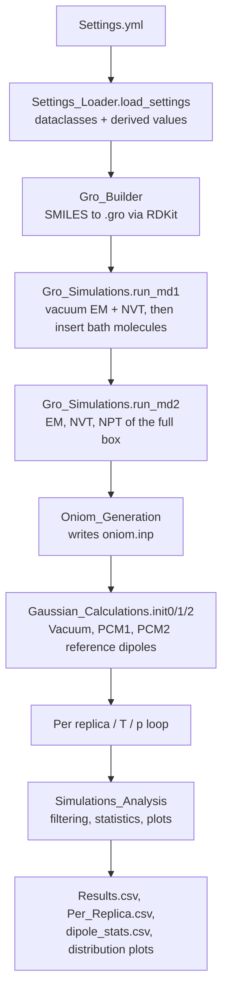
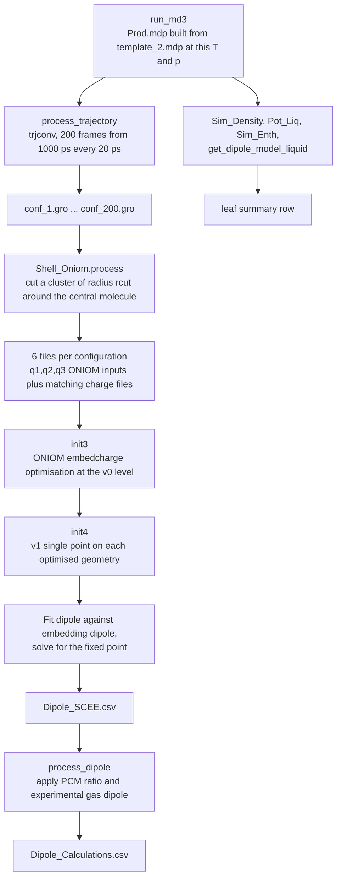
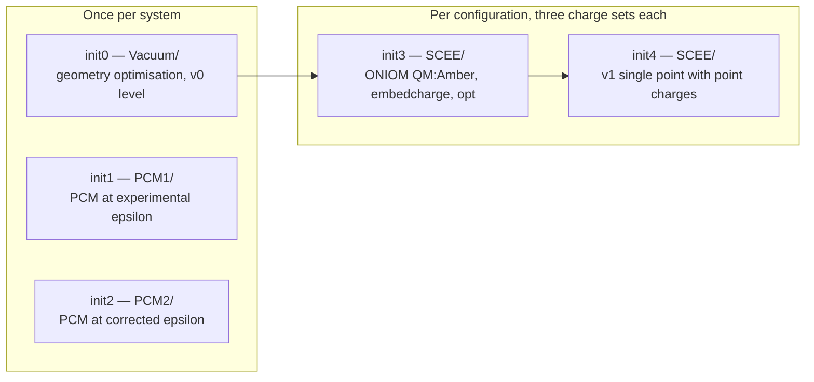

# The Automated SCEE Pipeline — Code Overview

A walkthrough of what each module does, what it needs as input, and what it produces.
Intended as a companion to the methods chapter: the chapter explains *why*, this explains *where in the code*.

**Entry point:** `Run_SCEE.py`
**Configuration:** `Settings.yml`
**External programs:** GROMACS (via the `GromacsWrapper` Python package) and Gaussian 09.

---

## Contents

1. [What the pipeline calculates](#1-what-the-pipeline-calculates)
2. [Workflow at a glance](#2-workflow-at-a-glance)
3. [Module map](#3-module-map)
4. [What you must supply before running](#4-what-you-must-supply-before-running)
5. [`Settings.yml` reference](#5-settingsyml-reference)
6. [Stage-by-stage walkthrough](#6-stage-by-stage-walkthrough)
7. [The `oniom.inp` file format](#7-the-oniominp-file-format)
8. [The self-consistency step, in detail](#8-the-self-consistency-step-in-detail)
9. [Output file reference](#9-output-file-reference)
10. [Directory layout produced by a run](#10-directory-layout-produced-by-a-run)
11. [Units and conversions](#11-units-and-conversions)
12. [Current scope, assumptions and things to check](#12-current-scope-assumptions-and-things-to-check)

---

## 1. What the pipeline calculates

The goal is the **liquid-phase dipole moment** of a molecule, obtained by embedding one QM molecule in a
classical bath drawn from an MD trajectory, and iterating until the QM molecule's dipole is consistent with
the field produced by its surroundings.

The physical chain is:

| Symbol | Meaning | Where it comes from |
|---|---|---|
| μ_model (gas) | Force-field dipole of the isolated molecule | `gmx dipoles` on the vacuum NVT run |
| μ_model (liquid) | Force-field dipole averaged over the liquid | `gmx dipoles` on the production run |
| μ_Vacuum | QM dipole of the gas-phase optimised molecule | Gaussian, `Vacuum/` |
| PCM1 | QM dipole in a continuum with the **experimental** ε | Gaussian, `PCM1/` |
| PCM2 | QM dipole in a continuum with ε − n² + 1 | Gaussian, `PCM2/` |
| μ_SCEE | Self-consistent QM dipole in the explicit cluster | Gaussian ONIOM + fixed-point fit |
| Δμ | `μ_SCEE × (PCM1 / PCM2) − μ_Vacuum` | `Simulations_Analysis.process_dipole` |
| μ_liquid | `Δμ + μ_gas(experimental)` | `Simulations_Analysis.process_dipole` |

The PCM1/PCM2 ratio is the correction that removes the fast electronic (optical) response already implicitly
present in the cluster calculation; the experimental gas dipole then anchors the final number so that the
result is a *change* predicted by the calculation added to a measured baseline.

Everything else in the code — box building, equilibration, cluster extraction, job throttling, outlier
filtering — exists to produce that table reliably and automatically for a list of state points and replicas.

---

## 2. Workflow at a glance

![[SCEE_workflow_draft.svg]]

The figure above is the full picture: inputs, the script that owns each stage, the function called, what it
does, and what it produces. Drop the `.svg` anywhere in the vault and the embed resolves by name. To scale
it down on the page, use `![[SCEE_workflow_draft.svg|1000]]`.

The Mermaid diagrams below are the same pipeline at lower resolution — useful for reading on a phone or
pasting into a message.

### Top-level flow



### Inside the per-state-point loop

Each iteration runs in its own leaf directory, `Simulations/replica_{n}/{T}K/{p}Bar`.



### Gaussian job structure



---

## 3. Module map

| File | Type | Responsibility |
|---|---|---|
| `Run_SCEE.py` | Top-level script | Orchestrates everything. Owns the replica × T × p loop and the final collation. |
| `Settings_Loader.py` | Dataclasses + loader | Parses `Settings.yml`, validates structure, computes derived quantities. |
| `Gro_Builder.py` | Class `Gro_Builder` | Builds `.gro` files from SMILES with RDKit (all-atom and united-atom). |
| `Gro_Simulations.py` | Class `Gro_Simulations` | All GROMACS calls: equilibration, insertion, production, trajectory splitting. |
| `Oniom_Generation.py` | Class `Oniom_Generation` | Reads GROMACS topologies and writes the `oniom.inp` control file. |
| `Atoms.py` | Class `Atoms` | Maps GROMACS atom names/masses onto element symbols; flags dummy sites. |
| `Shell_Oniom.py` | Class `ShellOniom` + functions | Python port of `Shell_Oniom.f90`. Cuts the solvation shell and writes Gaussian ONIOM inputs. |
| `Gaussian_Calculations.py` | Class `Gaussian_Calculations` | Writes every Gaussian input, launches g09 with throttling, parses multipoles, performs the self-consistency fit. |
| `Simulations_Analysis.py` | Class `Simulations_Analysis` | GROMACS post-processing (density, ε, potential energies), outlier filtering, statistics, plots, final tables. |

Dependency direction is one-way: `Run_SCEE` → everything; `Gaussian_Calculations` → `Shell_Oniom`, `Atoms`,
`Simulations_Analysis`; `Oniom_Generation` → `Atoms`.

---

## 4. What you must supply before running

Some inputs are named in `Settings.yml`; others are found **by filename** and are therefore easy to miss.

### Named in `Settings.yml`
- Everything in [section 5](#5-settingsyml-reference), including the Gaussian install root and scratch directory.

### Found by filename (must exist, must be named exactly this)

| File | Needed by | Notes |
|---|---|---|
| `Pure.top` | `run_md1/2/3`, `Oniom_Generation` | Must `#include` the force field and the molecule `.itp` files. The bath molecule count line is **appended by the code**, so the file should not already contain it. |
| `Solvent.itp` | `Oniom_Generation.QM_Inputs` (pure), `MM_Inputs` (AA bath) | Atom order must match the `.gro`. |
| `Solvent_UA.itp` | `Oniom_Generation.MM_Inputs` when `AA_Surround: No` | |
| `Mixture.top`, `Solute.itp` | mixture runs only | |
| `minim_vacuum.mdp` | `run_md1` | Vacuum energy minimisation. |
| `nvt_vacuum.mdp` | `run_md1` | Vacuum NVT; produces `nvt_vacuum2.gro/.edr` used for the gas reference and all Gaussian geometries. |
| `minim.mdp`, `nvt.mdp`, `npt.mdp` | `run_md2` | Condensed-phase equilibration. |
| `template_2.mdp` | `run_md3` | Production template containing the literal strings `TEMPERATURE` and `PRESSURE`, substituted per state point. `template_1.mdp` is the Parrinello–Rahman variant and is not used by default. |
| `Solvent_UA.gro` | `insert_Molecules` when `AA_Surround: No` and no UA SMILES build | |
| `Results/` directory | `Simulations_Analysis`, `save_settings_snapshot` | Must exist inside the system directory before the run — nothing creates it. |

The whole run happens **inside a directory named after `System_Title`** (`Run_SCEE.py` does `os.chdir` into
it as its first action), so all of the above live in that directory.

### Software assumptions
- `g09root_override` **must** be set. Auto-detection raises `NotImplementedError`.
- The throttle counts running `g09` and `mdrun` processes with `pgrep`, so it will also see unrelated jobs
  belonging to the same user on the same machine.

---

## 5. `Settings.yml` reference

### `State_Conditions`
| Key | Type | Used by | Meaning |
|---|---|---|---|
| `Temperature` | list, K | `run_md3`, loop, output tables | One production run per entry. |
| `Pressure` | list, bar | as above | Full Cartesian product with temperature. |
| `Replicas` | int | loop | Produces `replica_1 … replica_N`. Replicas differ only by the random seed in the `.mdp`. |

### `Molecule_Information`
| Key | Used by | Meaning |
|---|---|---|
| `System_Title` | directory name, `oniom.inp`, output prefix | Also becomes the Gaussian input filename prefix, e.g. `Propylamine_c17_q2.inp`. |
| `Gas_Dip` | `process_dipole`, filtering | Experimental gas-phase dipole. Doubles as the **physical outlier floor** — configurations with μ_liquid below it are discarded. |
| `Di_Const` | `init1` | Experimental ε, used in PCM1. |
| `Ref_Ind` | `Settings_Loader`, dielectric correction | Refractive index n. |
| `sol_keyword` | `init0/1/2` | Gaussian SCRF solvent keyword. Must be one of the names on Gaussian's [SCRF solvent list](https://gaussian.com/scrf/) — see the *Solvents* section at the foot of that page. |
| `density`, `mol_mass` | `Settings_Loader` | Used to compute how many molecules fill the box. |
| `AA_Surround` | `Gro_Builder`, `insert_Molecules`, `MM_Inputs` | `Yes` → all-atom bath; `No` → united-atom bath. |
| `Solvent_Smiles` | `Gro_Builder` | Set to `null` to supply your own `Solvent.gro` instead. |
| `Mixture`, `Solute_Smiles` | mixture branch | See [section 12](#12-current-scope-assumptions-and-things-to-check). |

### `Advanced_Settings`
| Key | Used by | Meaning |
|---|---|---|
| `configuration.box_length_nm` | `run_md1`, molecule count | Target cubic box edge. **`run_md1` adds 1.7 nm** before calling `editconf`; the NPT step then compresses to the true density. |
| `configuration.cluster_radius_nm` | `oniom.inp` header → `Shell_Oniom` | Radius of the explicit cluster, measured centre-to-centre. ~2.5 nm minimum. |
| `sampling.n_configurations` | `oniom.inp` header | Number of frames processed. Must be consistent with the production length and the `dt=20`, `b=1000` extraction. |
| `electrostatics.charge_scaling.qr1/2/3` | `Oniom_Generation`, `init4` | The three embedding charge multipliers. `qr1 = 1.0` is the unscaled force field. These three points define the fitted curve. |
| `electronic_structure.v0` | all Gaussian steps | Low level: optimisations and the ONIOM QM layer. |
| `electronic_structure.v1` | `init1/2/4` | High level: single-point dipoles. |
| `filtering.*` | `plot_state_point` | IQR multiplier, pass cap, early-stop threshold, and the minimum kept-configuration floor. |

### `Software`
| Key | Meaning |
|---|---|
| `GROMACS.ntmpi/ntomp/pin/pinoffset` | Passed straight to `gmx mdrun`. Set on the `MD` object in `Run_SCEE.py`. |
| `Gaussian.g09root_override` | Gaussian install root; sourced in the generated bash script. |
| `Gaussian.scratch_dir` | Becomes `GAUSS_SCRDIR`. The code supports a *list* internally (round-robin across scratch disks) although the YAML currently supplies one. |
| `Gaussian.max_jobs` | Ceiling on concurrent `g09` + `mdrun` processes. |
| `Gaussian.nproc`, `mem` | `%nprocshared` and `%mem` in every Gaussian input. |

### Derived at load time (`Settings_Loader.__post_init__`)
| Quantity | Formula | Used by |
|---|---|---|
| `calculated_dielectric` | ε_exp − n² + 1, rounded to 3 dp | `init2` (PCM2) |
| `N` | ρ V / M × N_A, with V = (L × 10⁻⁷ cm)³ | molecule count |
| `initial_molecules` | `ceil(N + 0.05 N) − 1` | `insert-molecules`, topology line, `oniom.inp` |
| `is_mixture`, `build_solvent_gro`, `build_solute_gro` | flags from the YAML | branch control in `Run_SCEE.py` |

The 5 % buffer compensates for the loose starting box; the `− 1` accounts for the central molecule already
present from the vacuum step.

---

## 6. Stage-by-stage walkthrough

### Stage 0 — Configuration and setup (`Run_SCEE.py`, `Settings_Loader.py`)

**In:** `Settings.yml`
**Out:** a `Settings` object; a timestamped copy at `Results/settings_{System_Title}_{timestamp}.yml`

`load_settings()` maps the YAML onto nested dataclasses, so every downstream access is an attribute
(`settings.advanced.filtering.iqr_k`) rather than a dictionary lookup — a typo becomes an `AttributeError`
at the point of use rather than a silent `None`. The snapshot means every results directory records the
exact settings that produced it.

Two interactive confirmation prompts exist (`ready = input()`) but are currently **hard-coded to `'Yes'`**
so the script runs unattended. Uncomment them for supervised runs.

---

### Stage 1 — Molecule construction (`Gro_Builder.py`)

**In:** SMILES string
**Out:** `Solvent.gro` (+ `Solvent.png`), optionally `Solvent_UA.gro`, `Solute.gro` (+ `Solute.png`)

| Method | Produces | Residue name |
|---|---|---|
| `AA_Solvent(smiles)` | `Solvent.gro` | `Solv` |
| `AA_Solute(smiles)` | `Solute.gro` | `Solu` |
| `UA_Solvent(smiles)` | `Solvent_UA.gro` | `Solv` |

Both routes use RDKit: `MolFromSmiles` → `AddHs` → `EmbedMolecule` → `UFFOptimizeMolecule`, then write
coordinates converted from Å to nm. The box vector is written as `0 0 0`; `editconf` sets the real box in
the next stage.

The **united-atom** route additionally reorders and prunes atoms to the conventional UA layout:

1. heteroatoms
2. carbons
3. polar hydrogens (bonded to anything other than carbon)
4. explicit hydrogens on sp²/aromatic carbons

Aliphatic hydrogens on sp³ carbons are dropped entirely, their mass being absorbed into the carbon by the
force field. Atom names in the AA file are bare element symbols, so **the `.itp` atom order must match the
RDKit order** — this is the manual step the pipeline cannot yet do for you.

---

### Stage 2 — Vacuum equilibration and box filling (`Gro_Simulations.run_md1`)

**In:** `Solvent.gro` (or `Solute.gro` for mixtures), `Pure.top`, `minim_vacuum.mdp`, `nvt_vacuum.mdp`
**Out:** `em.tpr/.gro`, `nvt_vacuum2.gro/.edr/.tpr`, `out.gro`, and an appended line in `Pure.top`

Steps, in order:

1. `editconf` places the single molecule in a cubic box of edge `box_length_nm + 1.7`.
   The offset is empirical: `insert-molecules` needs headroom to place molecules without clipping.
2. Energy minimisation in vacuum → `em.gro`.
3. NVT in vacuum → **`nvt_vacuum2.gro`**. This file is the single most reused artefact in the pipeline: it
   supplies the geometry for the Vacuum, PCM1 and PCM2 Gaussian jobs, and its `.edr` supplies the gas-phase
   potential energy for ΔH_vap.
4. `insert_Molecules` adds `initial_molecules` copies of the bath molecule (`Solvent.gro` if `AA_Surround`,
   otherwise `Solvent_UA.gro`) → `out.gro`.
5. `Write_to_top` appends `Solvent   <count>` (or `Solvent_UA   <count>`) to the topology.

The `role` argument (`'pure'` / `'mixture'`) selects the central molecule, topology and filename suffix
(`''` vs `'_solute'`) throughout this module.

> Worth knowing: `gmx insert-molecules` can place **fewer** molecules than requested if the box is tight.
> The topology line and `oniom.inp` are both written from the *requested* number, so a shortfall surfaces
> later as a `grompp` atom-count error or as `Shell_Oniom`'s "Atom count mismatch" exception.

---

### Stage 3 — Condensed-phase equilibration (`Gro_Simulations.run_md2`)

**In:** `out.gro`, topology, `minim.mdp`, `nvt.mdp`, `npt.mdp`
**Out:** `em1.gro`, `nvt_eq.gro`, **`npt.gro`** (the starting structure for every production run)

Straightforward EM → NVT → NPT chain. `npt.gro` is read from `HOMEDIR` by every leaf-directory production
run, so all replicas and state points start from the same equilibrated box.

---

### Stage 4 — Building `oniom.inp` (`Oniom_Generation.py`, `Atoms.py`)

**In:** `Solvent.itp` / `Solute.itp` / `Solvent_UA.itp`, plus the full `#include` tree of the `.top`
**Out:** `oniom.inp`

This is the hand-off file between the GROMACS world and the Gaussian world: it translates force-field
parameters into the form `Shell_Oniom` needs. Four calls, in this order, each appending to the file:

| Call | Writes |
|---|---|
| `Gen_File` | Header: number of configurations, output prefix (= `System_Title`), cutoff radius |
| `QM_Inputs` | QM block: atom count, central atom index, one line per atom (with dummy flag) |
| `MM_Inputs` | MM block: same for one bath molecule (no dummy flag) |
| `Counting_Molecules` | Number of bath molecules in the box |

**Element assignment** (`Atoms.py`). GROMACS atom names are not elements, so `gaussian_symbol_from_atomname`
resolves them in priority order: dummy prefixes (`DUM`, `VS`, `EP`, `LP`, `MW`) → Gaussian's `Bq`; ambiguous
two-letter prefixes (`CA`, `NA`, `CL`, `BR`, `SI`) disambiguated **by mass** within 2 amu; then a two-letter
element match; then a one-letter match; then a pure mass fallback within 1 amu. A separate
`gaussian_symbol_from_gro_name` is used when only a name is available (no mass), and there the ambiguous
cases fall back to organic-chemistry defaults (`CA` → C, `NA` → N).

`Atom_Types` returns four things: unique labels (`C1`, `C2`, `H1`…), element symbols, a dummy flag per atom,
and the total atom count.

**LJ parameters.** `build_atomtype_table` walks the `.top` and every `#include` recursively, parsing
`[ atomtypes ]` in both the 7-column and 8-column forms; later definitions override earlier ones, matching
GROMACS' own behaviour. σ is converted nm → Å; ε is left in kJ/mol at this point. Two special cases:

- Water oxygen (`OW`) passes through normally.
- Polar hydrogens (`HO`, `HN`, `HW`) that carry **zero** LJ parameters are given σ = 0.2673 Å and
  ε = 0.0418 kJ/mol. This is a hard-coded floor that prevents the QM/MM interaction from collapsing onto a
  bare proton. Note this value is written directly in Å, not scaled by 10 like the others.

**Charges.** `qmax` is the largest-magnitude partial charge in the molecule, and `wi = qi / qmax`. Each atom
then gets three charges, `q_k = q_i × qr_k`. Water is special-cased by atom name:

| Site | QM block | MM block |
|---|---|---|
| `OW` | −qmax × qr_k | 0 |
| `MW` | 0 | −qmax × qr_k |

That is, the QM molecule collapses a four-site model's M-site charge onto the oxygen, while the bath keeps
the M-site. The central atom index is the `OW` atom if one exists, otherwise the atom carrying `qmax`.

---

### Stage 5 — Production and frame extraction (`Gro_Simulations.run_md3`)

**In:** `npt.gro`, topology, `template_2.mdp`, plus T and p from the loop
**Out:** `Pure_QMMM_md3.{tpr,trr,xtc,edr,gro}` and `conf_*.gro`

`create_mdpfile` reads `template_2.mdp` and substitutes the literal tokens `TEMPERATURE` and `PRESSURE`,
writing `Prod.mdp` in the leaf directory. `template_2.mdp` uses the C-rescale barostat; `template_1.mdp`
(Parrinello–Rahman) is retained but unused.

`process_trajectory` then runs `trjconv` with `pbc='whole'`, `b=1000`, `dt=20`, `sep=True`, producing one
`.gro` per frame — the 200 configurations, one every 20 ps after 1 ns of equilibration. `Shell_Oniom` reads
`conf_1.gro` through `conf_{n_configurations}.gro`.

---

### Stage 6 — Cluster extraction (`Shell_Oniom.py`)

**In:** `oniom.inp`, `conf_N.gro`
**Out:** six files per configuration

This is a direct Python port of `Shell_Oniom.f90`, and the docstrings record where the port deviates from
the Fortran (whitespace-tolerant parsing instead of fixed Fortran column widths; cleaner fixed-decimal
formatting of the VDW block, which Gaussian parses identically).

For each configuration:

1. `parse_gro` reads coordinates by **column position** (x at 20:28, y at 28:36, z at 36:44), which is the
   only reliable way to read `.gro` files once atom indices exceed five digits.
2. The first `n_qm` atoms are the QM molecule; the rest are bath molecules in blocks of `n_mm_per_mol`.
   A count mismatch raises immediately.
3. Every bath molecule whose central atom lies within `rcut` of the QM centre is included, using
   minimum-image periodic boundaries. All coordinates are re-expressed relative to the QM centre and
   converted nm → Å.
4. **Even-count workaround:** if the total molecule count (QM + included bath) is even, the furthest
   included molecule is dropped. This works around a Gaussian bug and prints `REMOVED` when it fires.
5. Dummy atoms are written into neither the coordinate nor the connectivity block, and the MM connectivity
   indices are offset by the dummy count to compensate.

Files written per configuration, where `{P}` is the `System_Title` prefix:

| File | Contents |
|---|---|
| `{P}_c{N}_q1.inp`, `_q2`, `_q3` | ONIOM coordinate block (`H` layer for QM, `L` for MM), connectivity indices, and the `VDW` parameter block — one file per charge set |
| `{P}_c{N}_q1_chg.inp`, `_q2`, `_q3` | The bath atoms as bare point charges: x, y, z, q |

Unit conversions happen here: σ × 0.561231 (σ in Å → R_min/2 in Å, i.e. σ·2^(1/6)/2) and ε ÷ 4.184
(kJ/mol → kcal/mol), because Gaussian's Amber parameters are in Amber conventions.

---

### Stage 7 — Gaussian calculations (`Gaussian_Calculations.py`)

`gro_to_dat` converts `nvt_vacuum2.gro` into element symbols and coordinates, **recentred on the mean atomic
position** and converted nm → Å. This geometry feeds the three reference calculations.

| Method | Directory | Route section | Returns |
|---|---|---|---|
| `init0` | `Vacuum/` | `v0` optimisation (`fopt=tight`), then a `--Link1--` job re-reading the checkpoint | μ_Vacuum → `Dipole_Vacuum.csv` |
| `init1` | `PCM1/` | `v0` PCM optimisation at ε_exp, then `--Link1--` `v1` single point | PCM1 → `Dipole_PCM1.csv` |
| `init2` | `PCM2/` | as PCM1 but at ε − n² + 1 | PCM2 → `Dipole_PCM2.csv` |
| `init3` | `SCEE/` | `oniom(v0:amber=(print,SoftFirst,LastEquiv))=embedcharge`, `opt=quadmacro` | — (geometries only) |
| `init4` | `SCEE/` | `v1` single point with `charge` (external point charges) | `scee_df` → `Dipole_SCEE.csv` |

Both PCM jobs use `scrf=(pcm,solvent={sol_keyword},read)` with an `eps=` value supplied in the additional
input section. The named solvent sets the cavity radii and the rest of Gaussian's internal parameters for
that solvent; `eps=` then overrides the static dielectric constant alone. This matters for PCM2: the cavity
is still the one Gaussian defines for the real solvent, and only ε is changed, which is exactly the
controlled comparison the method needs. The keyword list and the accompanying ε values are documented on
the [SCRF keyword page](https://gaussian.com/scrf/).

All Gaussian inputs use `nosymm`, `pop=full`, `density=current`, `scf=(verytight)` and
`integral=(ultrafine,NoXCTest)`, so dipoles are comparable across the whole set.

`init3` prepends the route section to each `*_c*_q?.inp` produced by `Shell_Oniom` and writes the result as a
`.dat`. `init4` then reads the **Z-matrix orientation** from each ONIOM output — the geometry as optimised in
the field of the bath — pairs it with the corresponding `_chg.inp` point charges, and runs a high-level single
point. The result files are `*_c*_q?_v1.out`, parsed by `get_multipole_statistics_scee`.

`read_multipoles` extracts dipole, quadrupole and octapole from the Gaussian output by regex, always taking
the **last** match in the file (i.e. the final converged value), and returns `NaN` when a block is missing —
so a crashed job propagates as a missing configuration rather than a wrong number. Configurations are only
kept when all three charge sets produced a finite dipole.

**Job execution (`run_gaussian`).** Rather than calling g09 directly, the code *writes a bash script* and runs
it. The script sources `g09.profile`, round-robins `GAUSS_SCRDIR` across the configured scratch directories,
and before launching each job blocks in a `while` loop until `pgrep -c g09` plus `pgrep -c mdrun` falls below
`max_jobs`. Jobs then run in the background with a final `wait`. This is how hundreds of configurations ×
three charge sets are run without oversubscribing the machine.

---

### Stage 8 — Analysis and collation (`Simulations_Analysis.py`)

Per leaf directory:

| Method | Source | Produces |
|---|---|---|
| `get_dipole_model` | `gmx dipoles` on `nvt_vacuum2` | Force-field gas-phase dipole (`Dipole.txt`) |
| `get_dipole_model_liquid` | `gmx dipoles` on the production `.trr` | Force-field liquid dipole **and** model ε (`Dipole2.txt`) |
| `Sim_Density` | `gmx energy` | Simulated density in kg/m³ (`Density.txt`) |
| `Pot_Gas` / `Pot_Liq` | `pyedr` on the `.edr`, t ≥ 100 ps | Mean potential energies |
| `Sim_Enth` | — | ΔH_vap = U_gas − U_liq/N + RT |
| `process_dipole` | `Dipole_SCEE.csv` + PCM1/PCM2 | `Dipole_Calculations.csv` with Δμ and μ_liquid per configuration |

Then, across the whole run:

**Filtering (`plot_state_point`).** Applied per state point over the pooled replicas:

1. Drop non-finite configurations.
2. **Pass 1** removes both statistical outliers (outside Q1 − k·IQR to Q3 + k·IQR) and *physical* outliers —
   any configuration whose μ_liquid falls below the experimental gas dipole, which cannot be physical for a
   condensed phase.
3. Further IQR-only passes run up to `max_iqr_passes`, stopping early if a pass finds fewer than
   `min_pass_outliers`, and refusing to apply a pass that would breach `min_kept_configs`.
4. Every pass appends a row to `Results/dipole_stats.csv` (`raw`, `pass1`, …, `filtered`), each carrying
   mean/std/median/Q1/Q3 for μ_SCEE, Δμ and μ_liquid, plus outlier counts split into statistical and
   physical. A `below_floor` flag records whether the convergence floor was breached.
5. A histogram of kept (purple) versus removed (orange) values with a Gaussian fit is saved as
   `Results/dipole_distribution_T{T}K_p{p}Bar.png` and `.pdf`.

**Collation (`build_collection`).** Produces two tables. Per-replica means and standard errors
(σ/√n over configurations) go to `Per_Replica.csv`; system-level values — the mean over replicas, with
standard errors combined as √(Σ SE²)/n_replicas — go to `Results.csv`, along with every experimental input,
scaling factor, reference dipole and simulated property, so a single row fully documents a state point.

The dielectric correction, computed when μ_liquid exceeds the model liquid dipole, is
n² + (μ_liquid/μ_model)(ε_model + 1), with its error propagated as ((ε_model + 1)/μ_model)·SE(μ_liquid).
Where the condition is not met the entry is `NaN`.

`write_filtered_per_leaf` writes `Dipole_Calculations_filtered.csv` back into each leaf directory, preserving
every row but blanking the dipole columns of rejected configurations — so the rejection is auditable frame by
frame rather than silently dropped.

---

## 7. The `oniom.inp` file format

Written by `Oniom_Generation`, consumed by `Shell_Oniom.parse_oniom_inp`. Blank lines are separators.

```
200                                      <- number of configurations
Propylamine                              <- output filename prefix
2.8                                      <- cluster cutoff radius / nm

13 4                                     <- QM: number of atoms, central atom index (1-based)
N  N1  3.2500 0.7113  -0.90000 -1.21500 -1.53000 0
C  C1  3.3997 0.4577   0.12000  0.16200  0.20400 0
...                                      <- one line per QM atom

13 4                                     <- MM: number of atoms, central atom index
N  N1  3.2500 0.7113  -0.90000 -1.21500 -1.53000
...                                      <- one line per MM atom

1215                                     <- number of bath molecules in the box
```

Atom line fields, left to right:

| Field | Format | Meaning |
|---|---|---|
| element | a2 | Gaussian element symbol, `Bq` for dummies |
| type | a2 | Unique atom label (`C1`, `H3`…), used as the Amber type tag |
| σ | f7.4 | Å (converted to R_min/2 by `Shell_Oniom`) |
| ε | f7.4 | kJ/mol (converted to kcal/mol by `Shell_Oniom`) |
| q1, q2, q3 | 3a9 | The three scaled charges, kept as **strings** so the exact formatting reaches Gaussian |
| dummy | i1 | QM block only: 1 = dummy site, excluded from coordinates and connectivity |

The original Fortran enforced these column widths; the Python parser splits on whitespace instead, so the
widths are convention rather than requirement — but keeping them makes the file diffable against old runs.

---

## 8. The self-consistency step, in detail

This is the heart of the method, and it lives in the last twenty lines of `init4`.

Each configuration has been calculated three times, with all bath charges scaled by `qr1`, `qr2` and `qr3`.
Because scaling every partial charge scales the molecular dipole by the same factor, those three
calculations correspond to three **embedding dipoles**:

```
x_k = qr_k × μ_model(liquid)          k = 1, 2, 3
```

where `μ_model(liquid)` comes from `gmx dipoles` on the production trajectory. In the code this is written as
`ratio = μ_model / qmax` followed by `num_k = qr_k × ratio × qmax`, which is the same quantity.

The three QM dipoles obtained from those calculations are `y_k`. A quadratic is fitted, `y = a x² + b x + c`,
and the self-consistent point is where the response reproduces its own cause:

```
y(x) = x    →    a x² + (b − 1) x + c = 0
```

solved by the quadratic formula, taking the lower root. If the curvature is negligible or the discriminant is
negative, the code falls back to a linear fit and solves `μ = −c₁/(c₀ − 1)` instead. The result, `muL_SCEE`,
is one number per configuration, and it is that column which propagates through `process_dipole` into Δμ and
μ_liquid.

Two things follow that are worth stating explicitly for a reader of the chapter:

- `qr1 = 1.0` means the first point is the plain force field, so the fit is anchored at the unmodified model.
- The fixed point can lie outside the range spanned by `qr1`–`qr3`; it is an extrapolation of the fitted
  response curve, not an interpolation between calculated points. That is why the spread of `qr` values, and
  the quality of the three-point fit, matter.

---

## 9. Output file reference

### Written once, in the system directory
| File | Written by | Contents |
|---|---|---|
| `Solvent.gro`, `Solvent.png` | `Gro_Builder` | Built molecule and a 2D depiction for visual confirmation |
| `Solvent_UA.gro` | `Gro_Builder` | United-atom variant |
| `nvt_vacuum2.gro/.edr` | `run_md1` | Vacuum-equilibrated molecule; source geometry for all reference QM jobs |
| `npt.gro` | `run_md2` | Equilibrated box; starting point for every production run |
| `oniom.inp` | `Oniom_Generation` | The QM/MM control file |
| `Dipole_Vacuum.csv`, `Dipole_PCM1.csv`, `Dipole_PCM2.csv` | `init0/1/2` | Single-value reference dipoles |
| `Dipole.txt` | `get_dipole_model` | Raw `gmx dipoles` output, gas phase |
| `run_.sh`, `run__v1.sh` | `run_gaussian` | The generated job-submission scripts (useful when diagnosing a failed batch) |

### Written per leaf (`Simulations/replica_{n}/{T}K/{p}Bar/`)
| File | Contents |
|---|---|
| `Prod.mdp` | The production `.mdp` actually used, with T and p substituted |
| `Pure_QMMM_md3.{tpr,trr,xtc,edr,gro}` | Production run |
| `conf_*.gro` | Extracted configurations |
| `{Prefix}_c*_q?.inp`, `_chg.inp` | ONIOM inputs from `Shell_Oniom` |
| `SCEE/*.dat`, `*.out` | Gaussian inputs and outputs |
| `Dipole_SCEE.csv` | Per configuration: the three dipoles and the fitted `muL_SCEE` |
| `Dipole_Calculations.csv` | As above plus `delta_mu` and `mu_liquid` |
| `Dipole_Calculations_filtered.csv` | Same rows, with rejected configurations blanked |
| `Dipole2.txt`, `Density.txt` | Raw `gmx dipoles` / `gmx energy` output for the liquid |

### Written to `Results/`
| File | Contents |
|---|---|
| `Results.csv` | One row per state point: the headline numbers plus every input that produced them |
| `Per_Replica.csv` | One row per replica per state point |
| `dipole_stats.csv` | One row per filtering pass per state point — the audit trail for the filtering |
| `dipole_distribution_T{T}K_p{p}Bar.png` / `.pdf` | μ_liquid histogram with Gaussian fit, kept vs removed |
| `settings_{System_Title}_{timestamp}.yml` | Snapshot of the settings used |

---

## 10. Directory layout produced by a run

```
Propylamine/                      <- must be named after System_Title
├── Settings.yml
├── Pure.top, Solvent.itp, force-field .itp files
├── minim_vacuum.mdp, nvt_vacuum.mdp, minim.mdp, nvt.mdp, npt.mdp, template_2.mdp
├── Solvent.gro, Solvent.png, nvt_vacuum2.gro, npt.gro, out.gro
├── oniom.inp
├── Vacuum/       Vacuum.dat, Vacuum.out
├── PCM1/         PCM1.dat, PCM1.out
├── PCM2/         PCM2.dat, PCM2.out
├── Results/
│   ├── Results.csv, Per_Replica.csv, dipole_stats.csv
│   ├── dipole_distribution_T298K_p1Bar.png / .pdf
│   └── settings_Propylamine_20260819_143000.yml
└── Simulations/
    └── replica_1/
        └── 298K/
            └── 1Bar/
                ├── Prod.mdp, Pure_QMMM_md3.*
                ├── conf_1.gro ... conf_200.gro
                ├── Propylamine_c1_q1.inp ... (6 per configuration)
                ├── SCEE/   *.dat, *.out
                └── Dipole_SCEE.csv, Dipole_Calculations.csv
```

---

## 11. Units and conversions

| Quantity | GROMACS | Gaussian / Amber | Where converted |
|---|---|---|---|
| Length | nm | Å | `Gro_Builder` (÷10 on write), `gro_to_dat` (×10), `Shell_Oniom` (`NM_TO_ANG`) |
| σ | nm | R_min/2 in Å | ×10 in `Oniom_Generation`, ×0.561231 in `Shell_Oniom` |
| ε | kJ/mol | kcal/mol | ÷4.184 in `Shell_Oniom` (`KJ_TO_KCAL`) |
| Dipole | D (from `gmx dipoles`) | D | none needed |
| Energy | kJ/mol | — | ΔH_vap uses R = 8.314×10⁻³ kJ/mol/K |
| Density | kg/m³ (simulated) | g/cm³ (experimental input) | not converted — compare with care |

---

## 12. Current scope, assumptions and things to check

Written plainly, because these are the questions a reader will arrive at.

### Scope limits (by design, for now)
- Developed and tested against **GROMACS + Gaussian 09** only.
- Topologies must be **hand-built to match RDKit atom ordering**. This is the main manual step.
- Solvent choice is restricted to keywords on [Gaussian's SCRF solvent list](https://gaussian.com/scrf/)
  (`sol_keyword`). A solvent absent from that list would need defining through the PCM input section.
- The **mixture branch is a stub**: `Run_SCEE.py` builds the solute, runs `run_md1`, `run_md2` and `run_md3`
  for the mixture, and stops. No ONIOM generation, Gaussian calculation or analysis follows.
- `g09root` auto-detection is not implemented.
- The dielectric constant is handled as a post-hoc correction rather than being folded into the iteration.

### Points worth verifying before the next production run
- **`dipole_stats.csv` casing.** `Run_SCEE.py` deletes `./Results/Dipole_Stats.csv` at the start of the
  collation, but `_append_stats_rows` writes `./Results/dipole_stats.csv`. On Linux those are different
  files, so stats rows accumulate across runs instead of starting fresh.
- **`natom` and dummy atoms.** `Gauss.natom` is set to `Total_Atoms`, which *includes* dummy sites, but
  dummies are excluded from the ONIOM coordinate block. `init4` reads `natom` rows of the Z-matrix
  orientation, so for a model with virtual sites it would read past the QM molecule into the bath. Fine for
  everything run so far; needs checking before the dummy-hydrogen UA work goes through the pipeline.
- **Frame numbering.** `trjconv -sep` numbers output frames from zero, so the first extracted frame is
  `conf_0.gro`; `Shell_Oniom` reads `conf_1` upward. Worth confirming that the production run is long enough
  to supply `n_configurations` frames *after* the one that gets skipped.
- **Topology paths in `run_md3`** are asymmetric: the pure branch uses `HOMEDIR + '/Pure.top'` with a relative
  run name, while the mixture branch uses a relative `'Mixture.top'` with an absolute run name.
- **`get_multipole_statistics_scee`** contains the same glob-and-parse block twice. Harmless — the second
  pass overwrites with identical values — but it doubles the file reads over 600 outputs.
- **`get_gro` and velocities.** `gro_to_dat` assigns nine column names to the parsed DataFrame, so
  `nvt_vacuum2.gro` must contain velocities. It does when produced by `mdrun`, but a hand-edited or
  `editconf`-produced file would fail here.
- **The `Results/` directory must exist** before the run; nothing creates it.
- **The throttle counts all `g09` and `mdrun` processes**, including any belonging to other work on the same
  machine.

---

## External references

- **[Gaussian SCRF keyword documentation](https://gaussian.com/scrf/)** — the source of the `sol_keyword`
  values. The *Solvents* section at the foot of the page lists every accepted solvent name. Note Gaussian's
  own caveat: the ε printed alongside each name is one of several internal parameters defining that solvent,
  so changing ε alone does not define a new solvent.
- **[ONIOM technical note](https://gaussian.com/oniom_technote/)** — background on the ONIOM scheme used in
  `init3`.

---

*Generated from the source as of August 2026: `Run_SCEE.py`, `Settings.yml`, `Settings_Loader.py`,
`Gro_Builder.py`, `Gro_Simulations.py`, `Oniom_Generation.py`, `Atoms.py`, `Shell_Oniom.py`,
`Gaussian_Calculations.py`, `Simulations_Analysis.py`.*
